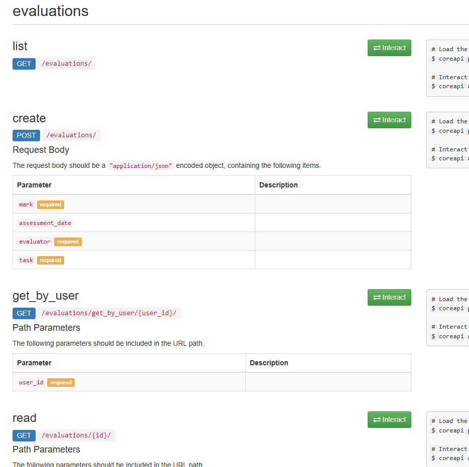
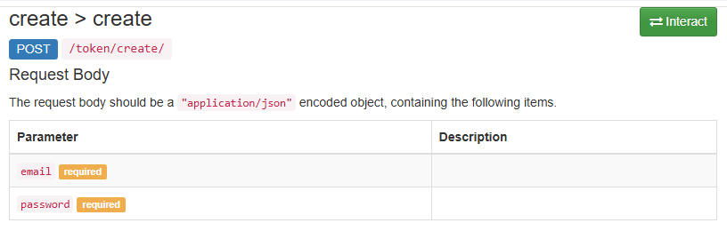

# PlainProject
Проект: Система управления бизнесом (Упрощённая версия)

<!--Установка-->
## Установка 
У вас должны быть установлены [зависимости проекта](https://github.com/Mike0001-droid/FinallyProject/blob/main/requirements.txt)

1. Клонирование репозитория 

```git clone https://github.com/Mike0001-droid/FinallyProject.git```

2. Переход в директорию finally_project

```cd finally_project```

3. Создание виртуального окружения

```python -m venv venv```

4. Активация виртуального окружения

```cd venv/scripts/activate```

5. Установка зависимостей

```pip install -r requirements.txt```

6. Запуск миграций

```python manage.py migrate```

7. Создание админа

```python manage.py createsuperuser```

8. Запуск сервера

```python manage.py runserver```

## Документация по API

1. API DRF 
    * Запускаем сервер Django
    * Переходим по адресу /api
        
    * Здесь мы можем тестировать эндпоинты. Давайте разберем набор эндпоинтов, связанных с выставлением оценок (Evaluations)
        
    * Чтобы протестировать запрос на получение всех записей данной таблицы, необходимо нажать зеленую кнопку Interact
        
    * Теперь нажимаем синюю кнопку Send Request и получаем результат
        
    * Самое интересное происходит, когда мы пытаемся добавить оценку
        
    * Заполнив все поля, мы получаем ошибку, связанную с авторизацией. Всё верно, оценки может ставить только администратор
    * Таким образом мы подходим к процессу авторизации


2. Авторизация по JWT - токену
    * Запускаем сервер Django
      
    * Переходим по адресу /api
      
    * Открываем приложение token и нажимаем на запрос create_token 
        
      
    * Вводим свои данные и нажимаем синюю кнопку Send Request и копируем access токен из результата
        
      
    * В нижнем левом углу нажимаем на вкладку Authentication и нажимаем на token
        
   
    * Записываем в поле Scheme - Bearer, а в поле Token вставляем скопированный токен, затем нажимаем синюю кнопку Use Token Authentication
      
        
      
    * Возвращаемся к созданию оценки
      
        
      
    * После авторизации получаем вот такой результат
      
        


3. Календарь встреч
    * Переходим по адресу /calendar
        
    * Здесь мы наблюдаем месячный вид наших встреч. Попробуем перейти на дневной вариант
        
    * Здесь мы можем узнать подробную информацию о встрече, нажав кнопку "Подробнее"
        
    * Так же можем удалить встречу. После нажатия нас перекидывает в админку, в которой мы можем произвести удаление
        
